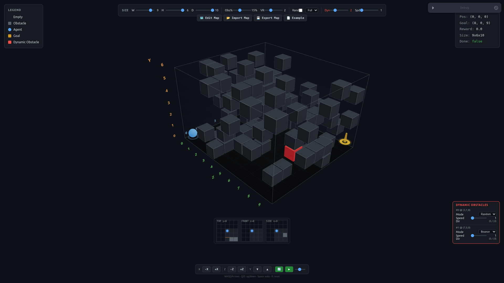

# 3D GridWorld

<a href="https://zhangshuaiqing.github.io/3D-GridWorld">
  
</a>

基于 Three.js + React 的 **三维网格世界环境**，用于强化学习可视化展示和 Agent 行为调试。从 2D GridWorld（[navigation-agent](https://github.com/zhangshuaiqing/navigation-agent)）升级为完整三维空间，Agent 可在 6 个自由度中移动。

**在线体验**: [zhangshuaiqing.github.io/3D-GridWorld](https://zhangshuaiqing.github.io/3D-GridWorld)

## 快速开始

```bash
git clone git@github.com:zhangshuaiqing/3D-GridWorld.git
cd 3D-GridWorld
npm install
npm run dev
```

浏览器打开 `http://localhost:5173`。同一局域网其他设备用 `http://<你的IP>:5173` 访问。

## 技术栈

| 层 | 工具 |
|---|------|
| 构建工具 | Vite |
| 语言 | TypeScript |
| UI 框架 | React + Zustand |
| 3D 渲染 | React Three Fiber (`@react-three/fiber`) |
| 3D 工具库 | `@react-three/drei` (OrbitControls, Text) |
| 调试面板 | leva |
| 测试 | Vitest |
| Python 通信 | WebSocket (`websockets`) |

## 功能清单

| 功能 | 说明 |
|------|------|
| 3D 场景渲染 | Three.js 三维网格、光照、OrbitControls 自由视角 |
| Agent 控制 | 6 方向离散动作，键盘/按钮/API 三种方式 |
| 静态障碍物 | 随机生成 + BFS 可达性保证 |
| 动态障碍物 | Bounce/Random 双模式，每个独立控制 |
| 三视图小地图 | TOP + FRONT + SIDE 三个截面辅助定位 |
| 观测模式 | Full（全局可视）/ Fog of War（迷雾探索） |
| 地图编辑器 | 键盘游标编辑 + JSON 文件导入/导出 |
| 坐标轴标注 | 3D 外框标注 X/Y/Z 坐标 |
| RL 接口 | `window.__gridworld` 完整 API + 事件系统 |
| Python 训练 | WebSocket 连接，Gymnasium 风格接口 |
| 局域网访问 | `npm run dev` 默认监听所有接口 |
| 单元测试 | Vitest，39 项覆盖核心逻辑 |

## 环境逻辑

### 三维空间

- 网格定义：`grid[x][y][z]`，x/z 为水平面，y 为高度
- 使用 Three.js 右手坐标系：X 向右、Y 向上、Z 向前
- 默认尺寸：6×4×6（W×H×D），可通过设置面板调节
- 支持随机/固定起点终点

### 动作空间

6 个离散动作：

| 动作 | 键位 | 方向 |
|------|------|------|
| 0 (+x) | D / → | 右 |
| 1 (-x) | A / ← | 左 |
| 2 (+y) | Q | 上 |
| 3 (-y) | E | 下 |
| 4 (+z) | W / ↑ | 前 |
| 5 (-z) | S / ↓ | 后 |

### 奖励设计

- 每步惩罚：`-0.1`
- 撞墙/越界：`-0.5`
- 碰撞动态障碍物：`-1.0`
- 向上移动：`-0.2`（爬坡代价）
- 向下移动：`0`（免费下降）
- 到达目标：`+10`
- 超过最大步数：`-5`

## RL 接口

浏览器控制台直接调用 `window.__gridworld`：

```javascript
__gridworld.getState()           // 获取完整状态
__gridworld.step(4)              // 执行动作 (0~5)
__gridworld.reset()              // 重置环境
__gridworld.setMode('fog_of_war') // 切换观测模式
__gridworld.on('goal', cb)       // 事件监听
__gridworld.seed(42)             // 设置随机种子
```

也可以通过 WebSocket 从 Python 训练脚本连接：

```python
from python_client import GridWorldClient
import asyncio, random

async def train():
    client = GridWorldClient()
    await client.connect()
    state = await client.reset(numDynamicObstacles=3)
    for step in range(100):
        state = await client.step(random.choice([0,1,2,3,4,5]))
        if state["done"]: break
    await client.close()

asyncio.run(train())
```

完整 API 文档见下方。

## 运行测试

```bash
npm run test        # 39 项测试
npm run test:watch  # 监视模式
```

测试覆盖：基础环境、6 方向移动、碰撞检测、奖励系统、目标检测、随机起终点、种子确定性、Fog of War、动态障碍物、边界情况。

## 目录结构

```
3D-GridWorld/
├── src/
│   ├── main.tsx               # 入口 + window.__gridworld 挂载
│   ├── App.tsx                # 主组件（3D 场景 + UI 面板）
│   ├── store.ts               # zustand 全局状态
│   ├── types.ts               # 类型定义
│   ├── constants.ts           # 常量
│   ├── logic/
│   │   └── gridworld.ts       # GridWorld3D 环境核心逻辑
│   ├── components/            # 3D 场景组件 (Grid/Agent/Goal/Obstacles 等)
│   ├── panels/                # UI 面板 (Control/Status/Settings/Observation 等)
│   └── rl/
│       └── interface.ts       # RL 接口实现
├── tests/
│   └── gridworld.test.ts      # 单元测试（39 项）
├── python_client.py           # Python 训练客户端
├── ws-plugin.ts               # Vite WebSocket 插件
├── vite.config.ts
└── docs/                      # GitHub Pages 部署
```

## 地图编辑器

点击顶部 **🗺️ Edit Map** 进入编辑器，键盘游标编辑：

| 键位 | 功能 |
|------|------|
| WASD / 方向键 | 移动游标 (XZ 平面) |
| Q / E | 游标上/下移动 |
| Space / F | 切换障碍物/空地 |
| R | 重置 |

工具栏：Clear（清空）、Random（随机填充）、Apply（应用）、Cancel（取消）
文件：Import Map（加载 JSON）、Export Map（导出 JSON）、Example（下载示例）

### JSON 地图格式

```json
{
  "width": 6, "height": 4, "depth": 6,
  "agentPos": [0, 0, 0], "goalPos": [5, 0, 5],
  "obstacles": [[1, 0, 1], [2, 0, 1], [3, 0, 1]]
}
```

## 动态障碍物

设置面板中 **Dyn** 滑块控制数量（0~8），**Spd** 控制速度。

右侧 **Dynamic Obstacles** 面板可单独设置：

- **Mode**: Bounce（碰壁反弹）/ Random（随机游走）
- **Speed**: 每 N 步移动一次

## 开发历程与踩坑记录

### 1. 从 2D 到 3D 的思维转换

升级到 3D 不只是坐标从 `(x,y)` 变成 `(x,y,z)`，BFS 从 4 方向扩展到 6 方向、障碍物分布从平面变成立体、观测空间重新定义。

### 2. Three.js 与 React 的状态同步

用 `useFrame` 轮询 store 导致 60fps 降至 20fps。解决方案：用 `useEffect` 监听特定状态 + Zustand 精确选择器订阅。

### 3. 地图编辑器的交互设计

鼠标点击编辑因事件被 OrbitControls 拦截而无法使用。最终改为**键盘游标控制**——在 3D 空间中反而比鼠标更精确。

### 4. WebSocket 通信架构

Python 不能直连浏览器。方案：Vite 开发服务器挂载 WebSocket 服务端，浏览器 bridge 脚本连接，形成 `Python ↔ Vite WS ↔ Bridge ↔ __gridworld` 链路。

### 5. GitHub Pages 部署

Actions 自动部署多次失败。最终方案：构建后 push `docs/` 目录，配合 Vite `base: '/3D-GridWorld/'` 和 `.nojekyll` 文件。

### 6. WebGL Context 创建失败

NVIDIA 驱动未配置导致浏览器用 llvmpipe 软渲染。修复驱动 + 添加 WebGL 检测提示。

### 7. TypeScript 严格模式

`erasableSyntaxOnly` 禁用 enum、`verbatimModuleSyntax` 要求 type-only import、`noUnusedLocals` 要求清理死代码。初期增加工作量但最终代码质量更高。

### 8. 奖励系统设计

Agent 在 fog_of_war 模式下徘徊不前。添加方向引导和多级奖励（爬坡 -0.2、下降免费、撞动态障碍 -1.0、到达 +10）。

## 许可证

MIT License © 2026 [zhangshuaiqing](https://github.com/zhangshuaiqing)
